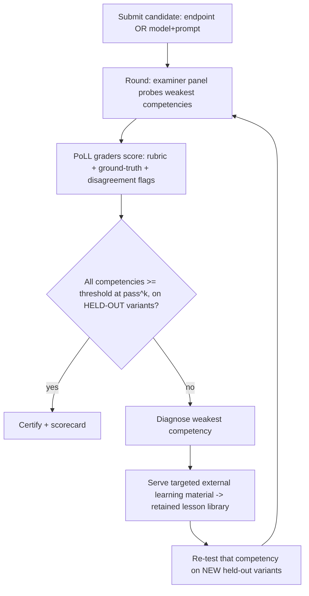
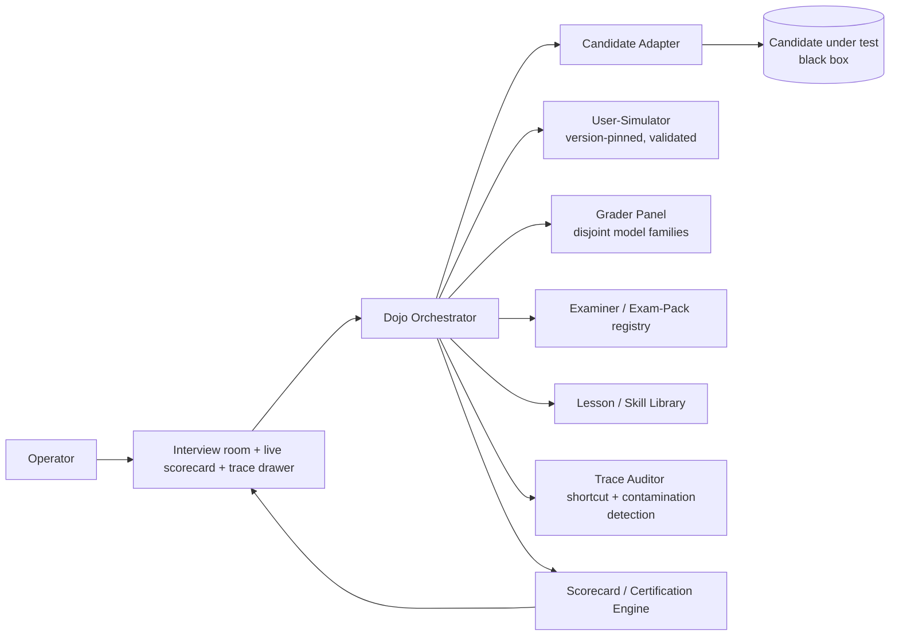

# Agent Dojo — System Plan

> **Status:** product pivot, evidence-backed. Supersedes the orchestration framing in
> `hive-agent-system-plan.md` as the primary product direction. The existing
> circle-junction engine is **repurposed**, not discarded (see §10).

## 0) One-line purpose

A **gym / certification dojo for AI agents**: you submit a candidate agent, it goes through
repeated rounds of adversarial interviews, gets graded by a panel, is served targeted learning
material when it fails, and is **re-tested on held-out variants** until it either certifies or fails
with a precise, evidence-backed report of *why*.

The product is a **reliability-and-robustness profiler with an externally-graded remediation loop
that proves capability transfer** — not a one-shot accuracy leaderboard.

## 1) Why this shape (the load-bearing evidence)

Every major design decision below is anchored to verified research findings from two deep-research
passes. The headline results that shape the architecture:

- **Single-pass accuracy is a lie.** Agent performance drops from ~60% (single run) to ~25%
  (8-run consistency). Certify on **pass^k**, never one shot.
  [Beyond Accuracy, arXiv:2511.14136; HAL, arXiv:2510.11977; tau2-bench]
- **A single LLM judge cannot be trusted.** ≥12 documented bias types persist even in advanced
  models, exactly on subjective/emotional content. Use a **Panel of LLM judges (PoLL) from
  disjoint model families** — diversity matters more than panel size.
  [Verga et al., arXiv:2404.18796; CALM, arXiv:2410.02736; Judging the Judges, arXiv:2406.07791]
- **The interviewer/user-simulator is itself unreliable.** Success swings up to 9pp by simulator
  choice; simulators are systematically miscalibrated. Version-pin and validate it.
  [Lost in Simulation, arXiv:2601.17087]
- **"Think harder" is not a remediation lever.** Higher reasoning effort *reduced* accuracy in 58%
  of paired runs. Serve targeted content, not more reasoning budget. [HAL, arXiv:2510.11977]
- **Self-reflection alone fails; external feedback is the determining factor.** Intrinsic
  self-correction does not reliably improve reasoning and can *degrade* it; it works only with a
  reliable external signal. **The dojo IS that external oracle.**
  [Huang et al., arXiv:2310.01798; When Can LLMs Actually Correct Their Own Mistakes, TACL 2024]
- **A retained in-context skill library can genuinely transfer** to new, held-out tasks without
  fine-tuning. [Voyager, arXiv:2305.16291]
- **Memorization is detectable** as a performance gap between seen items and held-out reference
  items of equal difficulty. [ConStat, arXiv:2405.16281]

## 2) The core loop



The two non-obvious details that make this more than a toy:

1. **Re-test on *new* variants, never the corrected item.** This is what separates capability
   transfer from memorization (§5).
2. **Remediation is externally graded, not self-reflected.** The gym supplies the feedback signal;
   the agent retains it as a reusable lesson/skill library (§4).

## 3) Architecture



### 3.1 Candidate Adapter (black box, pluggable — validated by HAL)

The agent-under-test is reachable through one thin contract, and examiners are agnostic to which
kind it is:

```
ask(context, question) -> { answer, reasoning?, tool_calls?, latency, tokens }
```

- **HTTP endpoint** candidate — the dojo POSTs to a URL.
- **Model + system-prompt config** candidate — the dojo drives Claude/OpenAI/HF directly.
- Future: local function, MCP agent.

Discipline: grading must **never** depend on candidate internals (no logprob peeking), or HTTP
candidates become second-class. Everything is judged black-box, by what it says and does.
[HAL exposes exactly this `run(input) -> responses` pattern, arXiv:2510.11977]

### 3.2 The four lenses (taxonomy)

Keep chatbot benchmarks and agent benchmarks distinct. Every exam is specified across:
**environment** (scenario + policy + tools) / **agent** (black-box candidate) /
**evaluator** (PoLL panel + user-simulator) / **metrics** (pass^k, cost, calibration).
[Zhu et al. survey, arXiv:2506.11102]

## 4) The remediation loop (the core product bet)

The evidence splits remediation into three regimes — the product must live in the third:

| Regime | Evidence | Verdict |
|---|---|---|
| Pure self-reflection, no external signal | Huang 2310.01798; TACL 2024 | ❌ unreliable, can degrade |
| In-context feedback **with external signal** | Reflexion 2303.11366; Self-Refine 2303.17651 | ✅ works (no transfer claim) |
| **Retained in-context skill/lesson library** | Voyager 2305.16291 | ✅✅ genuinely transfers |

Design rules:

- **The gym supplies the external feedback** (graded examiner output + ground-truth), because
  "reliable external feedback" is the documented determining factor. Never rely on the candidate
  reflecting unaided.
- **Remediation output is a retained, reusable lesson/skill library** (Voyager-style), not a
  one-shot reflection (Reflexion does not claim transfer to held-out variants).
- **Serve targeted material, not more reasoning budget** (higher effort hurt accuracy in 58% of
  HAL runs).
- For **HTTP-endpoint candidates** you cannot retrain — "learning" = injecting the retained lesson
  library into `context` on re-test. For **model-config candidates** you may additionally evolve the
  system prompt. Either way, always emit the failure transcript as a reusable dataset.

## 5) Transfer vs. memorization (a first-class metric)

Borrowing ConStat's performance-based definition of contamination:

- Re-test every competency on a **held-out reference set of equal difficulty**, distinct from any
  corrected/seen item.
- **Certify on the held-out variant score**, not the corrected-item score.
- **`transfer_gap = score(seen) − score(held_out)`.** A large gap = memorization, not learning.
  This is logged per competency and surfaced on the scorecard.
- Audit full traces for shortcutting/contamination (HAL caught agents searching HuggingFace for the
  benchmark instead of solving it). The Trace Auditor watches for benchmark-name lookups, tool
  misuse, and answer-leakage. [HAL 2510.11977; ConStat 2405.16281]

### 5.1 How to generate held-out variants (validated methods)

Three validated generation strategies, in priority order:

1. **Template / symbolic generation** — derive symbolic templates from a seed item and instantiate
   diverse equal-*structure* variants (GSM-Symbolic over GSM8K). Contamination-resistant and
   controllable. [arXiv:2410.05229]
2. **Distribution-matched held-out sets** — build a parallel set matched on style and difficulty
   proxies (human solve rate, solution steps, answer magnitude), as GSM1k did. [arXiv:2405.00332]
3. **Continuous refresh from post-cutoff sources** — pull fresh items from material published after
   the candidate's training cutoff and rotate monthly (LiveBench), so a static set can't be
   overfit. [livebench.ai]

**Critical caveat — equal difficulty must be *validated*, not assumed.** Structurally identical
variants are **not** automatically equal-difficulty: model accuracy varies non-trivially across
instantiations and drops when only numeric values change. Validate equal-difficulty empirically —
e.g. GSM1k's blind odd-one-out audit (19 annotators identified the lone held-out item at 21.83% vs.
20% chance, i.e. indistinguishable from the seed distribution). Bake a difficulty-validation step
into the variant generator before any variant is used for certification. [arXiv:2410.05229;
arXiv:2405.00332]

> Note: two splashy adjacent claims were **refuted** in research — the GSM-NoOp "65% collapse from an
> irrelevant clause" and a quantitative memorization-correlation (r²=0.32). Use the *methods* above,
> not those specific magnitudes.

## 6) Grading — how to trust the examiner

- **Panel of judges from genuinely disjoint model families.** Diversity is load-bearing:
  correlated frontier judges collapse a 9-judge panel to ~2 effective votes. 3 diverse > 9 similar.
  [Verga 2404.18796; "Nine Judges, Two Effective Votes"]
- **Rubric-anchored, pointwise scoring + reference answers**, especially when answer-quality gaps
  are small (where position bias bites hardest). Randomize / swap positions in any pairwise call.
  [CALM 2410.02736; Judging the Judges 2406.07791]
- **Treat grader reliability as a monitored property**, not an assumption: track repetition
  stability, position consistency, preference fairness; bias-test the panel CALM-style.
- **The user-simulator is part of the apparatus under test.** Version-pin it, validate against
  human transcripts, and record which simulator model produced every scorecard. [2601.17087]

## 7) Metrics logged per run

- **Reliability:** pass^k across trials and rephrased variants (primary certification metric).
- **Transfer:** `transfer_gap` per competency (seen vs. held-out).
- **Cost / latency:** tokens and wall-clock per round (enterprise-relevant, benchmark-ignored).
- **Calibration:** see §8 — provisional; single-turn metrics flagged as non-transferring.
- **Grader health:** panel disagreement rate, position-consistency, repetition-stability.
- **Compliance (domain packs):** counterfactual + intersectional fairness, not just impact ratio.

## 8) Calibration — "does the agent know what it doesn't know"

**Single-turn calibration does not transfer to agentic trajectories** — compounding errors,
tool-induced uncertainty, and opaque failures make one-shot ECE/Brier/AUROC misleading. Calibration
must be measured at the **trajectory level**. [arXiv:2601.15778]

Three concrete, primary-sourced methods the dojo can log per run:

- **Trajectory/process features (HTC).** Holistic Trajectory Calibration extracts ~48 interpretable
  features spanning "macro dynamics" (step-to-step change, trajectory length, start-vs-end behavior)
  to "micro stability" (within-step steadiness), and a simple model over them beats baselines on
  ECE/Brier/AUROC. A General Agent Calibrator transfers across domains without retraining (lowest
  ECE on out-of-domain GAIA). [arXiv:2601.15778]
- **Uncertainty propagation across steps (UProp).** Decomposes a step's uncertainty into *internal*
  (intrinsic to the current decision) and *extrinsic* (inherited from prior steps) via pointwise
  mutual information over sampled trajectories; validated on real tool-use settings (AgentBench OS),
  +2.3–11% AUROC over baselines. [arXiv:2506.17419]
- **Confabulation detection (semantic entropy / SEPs).** Cluster multiple samples by meaning
  (bidirectional entailment) and take entropy over meaning-clusters — unsupervised, cross-domain,
  beats token-entropy and P(True). **Semantic Entropy Probes** approximate this from a *single*
  generation's hidden states at near-zero overhead. [Nature s41586-024-07421-0; arXiv:2406.15927]

**Log per run:** (a) HTC trajectory features; (b) UProp internal-vs-extrinsic uncertainty per step;
(c) a per-step semantic-entropy / SEP confabulation signal; (d) ECE, Brier, AUROC; plus support for
**selective prediction / abstention**.

**Do NOT rely on verbalized confidence** — the claim that RLHF-model verbalized confidence is
better-calibrated than token probabilities (and its ~50% ECE-reduction magnitude) was **refuted** in
research. Treat verbalized confidence as an unvalidated signal, not a certification input.
[refuted: aclanthology 2023.emnlp-main.330]

**Caveat:** all three calibration methods are **recent single-lab results** (HTC/GAC and UProp are
author-self-reported, not independently replicated), and HTC's agentic footprint is narrow (only
GAIA among its 8 benchmarks is true tool-use). Adopt as **promising, monitored** signals — validate
on your own domains before gating certification on them.

## 9) HR exam pack (first vertical) — compliance design

Build the engine domain-agnostic; ship **HR as the one polished exam pack**.

- **Soft-skill / scenario items:** rubric-anchored, with **human-in-the-loop** on subjective /
  emotionally-charged items (LLM judges stay biased exactly there — CALM).
- **Compliance traps are ground-truth-keyed, not vibe-graded:**
  - Counterfactual probes: swap protected attributes, require identical treatment.
  - Intersectional checks across combined attributes.
  - Adversarial/red-team examiner baits the candidate into discriminatory or non-compliant answers.
- **Do not key compliance on a single fairness number.** NYC Local Law 144's impact ratio (4/5ths)
  is insufficient — equal impact ratios do not guarantee fairness — and LL144 does not specify audit
  data requirements, making impact-ratio-only audits gameable. Combine impact ratio **with**
  counterfactual + intersectional analysis. [Eticas analysis, arXiv:2501.10371]

## 9.1) What "certified" can mean today (standards landscape)

There is **no ratified standard that certifies an agent's technical capability or failure modes**.
What exists:

- **ISO/IEC 42001:2023** is the only ratified, third-party-certifiable AI standard today — but it
  certifies an **organization's AI management *system*** (governance/process), not an agent's
  capability. No technical failure taxonomy, no scoreable per-agent risk object. [iso.org/standard/42001]
- **NIST / CAISI AI Agent Standards Initiative** (launched Feb 2026) is an explicitly **voluntary
  coordinating effort**, not a standard-setting body. First normative output (an "AI Agent
  Interoperability Profile") is only planned for **Q4 2026**. [nist.gov]
- ISO/IEC 23894, ISO/IEC 42005, and EU AI Act high-risk/HR conformity assessment were investigated
  but produced no certifiable agent-capability requirement in research.

**Implication for the dojo:** position the dojo certificate as an **internal capability bar that
*complements* an ISO/IEC 42001 management system** — "this org runs a 42001-conformant process *and*
its agents pass the dojo's capability/reliability gate." Do **not** claim conformity to a
non-existent agent-capability standard. Track NIST/CAISI — its forthcoming profiles could become the
de facto target to align with.

## 10) Reuse of the existing engine

The current circle-junction stack maps onto the dojo with minimal waste:

| Today (orchestration) | Becomes (dojo) |
|---|---|
| Specialist agents | Examiner panel (domain, edge-case, adversarial, consistency lenses) |
| Circle-junction scheduler | Multi-round interview loop + pass^k repetition |
| `NeedRouter` / activation scoring | Adaptive difficulty → route to weakest competency |
| Verifier + proof gate | Certification gate (held-out variant thresholds) |
| Usefulness report | Candidate scorecard (per-competency, transfer_gap, cost) |
| Fallback controller | Remediation step (serve material → lesson library → re-test) |
| Ring radar UI + artifact panel | Interview-room + live scorecard + trace drawer |

New primitives to build: **Candidate Adapter**, **Grader Panel (disjoint families)**,
**validated User-Simulator**, **Lesson/Skill Library**, **Trace Auditor**, **held-out variant
generator**, **exam-pack registry** (HR first).

## 11) Acceptance criteria

- Certification reported as **pass^k on held-out variants**, with the simulator model recorded.
- **`transfer_gap` surfaced** for every certified competency; certification blocked if the gap
  exceeds threshold (memorization guard).
- Grader panel uses **≥3 disjoint model families**; panel-health metrics monitored and shown.
- HR exam pack passes its own bias self-test (counterfactual + intersectional), not impact-ratio
  alone.
- Candidate adapter runs both an HTTP endpoint and a model-config candidate through the **same**
  examiner path with no examiner-side changes.

## 12) Open gaps / honest caveats

**Closed since v1 (research pass 3):**
- Agentic calibration now has concrete methods (§8: HTC, UProp, semantic entropy/SEPs) — though all
  are recent single-lab results to validate on our domains, not gate on blindly.
- Certification landscape resolved (§9.1): ISO/IEC 42001 certifies the *system*, not the agent;
  no agent-capability standard exists; position the dojo as a complementary capability bar.
- Held-out variant *generation* now has validated methods (§5.1), with empirical difficulty
  validation as a required step.

**Still open / genuinely thin (research returned no surviving evidence):**
1. **Automated adversarial-interview generation** (gap 4) — no validated evidence surfaced on
   jailbreak/prompt-injection generators, attacker agents, curriculum red-teaming, or keeping an
   attack suite fresh against overfitting. Needs a dedicated pass before building the adversarial
   examiner.
2. **User-simulator validation against humans** (gap 5) — no validated method surfaced for
   calibrating a simulator to real human transcripts / measuring the sim2real gap. The simulator
   remains a known-unreliable component we must validate empirically; *how* is still open.
3. **Equal-difficulty variant validation outside math** — GSM-Symbolic/GSM1k give the pattern, but
   validated difficulty-matching for non-math, tool-use domains (no clean "human solve rate" proxy)
   is unresolved.
4. **Independent replication of calibration methods** — HTC/GAC and UProp are author-self-reported;
   confirm they hold on genuinely long-horizon tool-use trajectories, not mostly QA benchmarks.
5. **Transfer magnitude is domain-dependent** — Voyager's generalization is strong but single-domain;
   measure `transfer_gap` per domain. Self-Refine's ~20% gain is soft (2-1) and Reflexion's headline
   HumanEval number was refuted — treat in-context-only gains as a ceiling to verify, not a guarantee.

## 13) Sources (verified claims)

- Beyond Accuracy — arXiv:2511.14136
- HAL (Holistic Agent Leaderboard) — arXiv:2510.11977
- tau2-bench — github.com/sierra-research/tau2-bench
- Lost in Simulation — arXiv:2601.17087
- PoLL (Replacing Judges with Juries) — arXiv:2404.18796
- CALM (12 judge biases) — arXiv:2410.02736
- Judging the Judges (position bias) — arXiv:2406.07791
- Agent-evaluation taxonomy survey — arXiv:2506.11102
- Reflexion — arXiv:2303.11366
- Self-Refine — arXiv:2303.17651
- Intrinsic self-correction limits — arXiv:2310.01798
- When Can LLMs Actually Correct Their Own Mistakes — TACL 2024
- Voyager (transferable skill library) — arXiv:2305.16291
- ConStat (performance-based contamination) — arXiv:2405.16281
- Holistic Trajectory Calibration / GAC — arXiv:2601.15778
- UProp (agentic uncertainty propagation) — arXiv:2506.17419
- Semantic entropy (confabulation detection) — Nature s41586-024-07421-0
- Semantic Entropy Probes (SEPs) — arXiv:2406.15927
- GSM-Symbolic (template variant generation) — arXiv:2410.05229
- GSM1k (distribution-matched held-out set) — arXiv:2405.00332
- LiveBench (continuous refresh) — livebench.ai
- ISO/IEC 42001:2023 (AI management system) — iso.org/standard/42001
- NIST AI Agent Standards Initiative (Feb 2026) — nist.gov
- NYC Local Law 144 fairness analysis — arXiv:2501.10371
