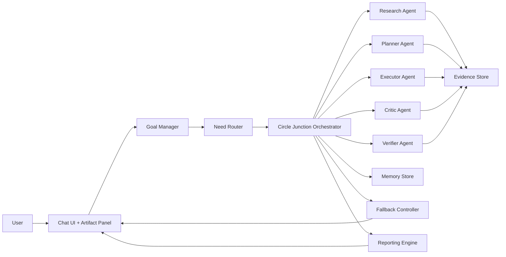

# Hive Agent System Plan

## 1) Goal
Build an adaptable "agent of agents" that:
- Works from explicit goals.
- Uses specialist agents only when needed.
- Rotates specialist input fairly in a traffic-circle style turn system.
- Has a reliable fallback path beyond a normal single-LLM response.
- Produces a usefulness report so we can measure value, not just output.

## 2) Product Requirements (from your request)
- Multi-agent hive mindset.
- Specialists should contribute in turns by specialty.
- "Use each other only when needed" (avoid unnecessary agent chatter/cost).
- Better reliability than a single prompt-response loop.
- Goal-driven execution and completion tracking.
- Pretty, Claude-like UI.
- Proper implementation plan and web-based benchmarking of similar projects.

## 3) Architecture Overview


## 4) Circle Junction Orchestration (traffic-circle model)

### 4.1 Roles
- `GoalManager`: turns user intent into measurable goals/subgoals.
- `NeedRouter`: predicts which specialists are needed this round.
- `CircleJunction`: controls turn order and fairness.
- Specialists:
  - `Research` (retrieval + grounding)
  - `Planner` (task decomposition)
  - `Executor` (tool actions)
  - `Critic` (counter-arguments/risk)
  - `Verifier` (fact + constraint checks)

### 4.2 Lanes
- `Main lane`: normal specialist turns.
- `Merge lane`: newly activated specialist enters at next safe turn.
- `Priority lane`: verifier or safety agent can preempt only on high-risk signals.

### 4.3 Turn Protocol
1. Build active ring from `NeedRouter` output.
2. Assign one baton token to the next active specialist.
3. Specialist must return structured output:
   - `contribution`
   - `confidence`
   - `evidence_refs`
   - `requested_next_role` (optional)
4. Orchestrator integrates contribution into shared state.
5. Advance baton to next specialist.
6. End round if completion criteria met, no new useful contributions, or budget reached.

### 4.4 Fairness + efficiency rules
- No specialist can take two turns in a row unless every other active specialist has passed.
- Specialists can `PASS` if confidence is low or no new value.
- Auto-skip specialist after N low-value turns in same goal stage.
- A specialist can request another specialist, but `NeedRouter` must approve.

## 5) "Only Use Each Other When Needed" logic
Use a gating score before activating each specialist per round:

`activation_score = expected_utility - cost_penalty - latency_penalty + risk_reduction`

Activate specialist only if:
- `activation_score >= threshold`, or
- specialist is mandatory for policy/safety (for example, `Verifier` before final answer).

Input features for gating:
- Goal type (research-heavy, planning-heavy, execution-heavy).
- Missing evidence count.
- Current uncertainty.
- Tool requirement likelihood.
- Remaining time/token budget.

## 6) Goal-driven execution model

### 6.1 Goal object
```json
{
  "goal_id": "G-2026-001",
  "title": "User objective",
  "success_criteria": ["..."],
  "constraints": ["time", "budget", "safety"],
  "priority": "high",
  "subgoals": [],
  "status": "active"
}
```

### 6.2 Completion model
Each subgoal gets:
- `done`: boolean
- `confidence`: 0-1
- `evidence_count`
- `blocking_reason` (if not done)

System only returns `completed` when all required success criteria are satisfied.

## 7) Reliability and fallback design

### 7.1 Multi-layer fallback
- `Layer 0`: Baseline single-agent draft (fast path).
- `Layer 1`: Circle-junction multi-agent pass.
- `Layer 2`: Verifier + deterministic checks (tools, citations, constraint checks).
- `Layer 3`: If quality is below threshold, return safest valid baseline + explicit uncertainty.

### 7.2 Confidence policy
Final confidence combines:
- agreement score among specialists,
- verifier pass rate,
- evidence quality,
- contradiction count.

If confidence < threshold:
- do not over-claim,
- surface uncertainty + next best action,
- optionally request human approval for high-risk actions.

### 7.3 Why this improves reliability
- Independent specialist views reduce single-prompt blind spots.
- Verifier pre-release gate catches contradictions and unsupported claims.
- Baseline fallback prevents empty or unstable outputs.

## 8) Usefulness report (required output)
Generate per run and periodic reports:

### 8.1 Per-run report fields
- Goal completion status.
- Which specialists were activated and why.
- Contribution usefulness per specialist (0-100).
- Cost/time per specialist.
- Evidence count and verifier outcomes.
- Fallback layer used.

### 8.2 Weekly report fields
- Goal completion rate.
- First-pass success rate.
- Fallback invocation rate.
- Avg tokens and latency.
- Specialist utilization map.
- Top failure modes + fixes.

## 9) UI plan (Claude-like, but your own brand)

### 9.1 Layout
- Center: conversation thread.
- Right panel: live artifacts (goal tree, ring state, report, citations).
- Bottom: sticky composer with model/tools status.

### 9.2 Visual direction
- Clean light-first palette with soft contrast, glass cards, muted borders.
- Large readable typography, generous spacing, subtle motion.
- Minimal iconography and clear hierarchy.

### 9.3 Key UI modules
- `Goal Card`: objective, criteria, progress.
- `Ring Radar`: who has the baton, who is waiting, who passed.
- `Evidence Drawer`: source links and confidence badges.
- `Fallback Badge`: baseline vs multi-agent vs verified path.
- `Run Report`: usefulness and cost summary.

### 9.4 Interaction constraints
- Keep chat input as the main language interface.
- Use visible controls (chips/toggles/tabs), avoid hidden menus.
- Mobile-first responsive card behavior and no deep nested nav.

## 10) Suggested MVP stack
- Backend: Python `FastAPI`.
- Orchestration: `LangGraph` state graph + custom ring scheduler.
- Storage: Postgres (goals/runs), Redis (short-lived ring state), object store for artifacts.
- Frontend: Next.js + Tailwind + component system (shadcn or custom).
- Observability: OpenTelemetry + structured run logs.

## 11) MVP roadmap (6-week plan)

### Week 1
- Goal schema, run schema, baseline single-agent path.
- Basic chat UI shell.

### Week 2
- Ring orchestrator with baton turns and PASS/SKIP logic.
- 3 specialists: planner, researcher, verifier.

### Week 3
- Need-based activation scoring.
- Evidence store and citation linking.

### Week 4
- Fallback controller and confidence policy.
- Usefulness report v1.

### Week 5
- Claude-like UI polish: artifact panel, ring radar, animations.
- Mobile responsive pass.

### Week 6
- Eval suite, regression tests, failure drills, launch checklist.

## 12) Acceptance criteria
- >= 85% of benchmark goals meet success criteria.
- >= 30% reduction in unnecessary specialist calls vs always-on multi-agent baseline.
- Verifier catches >= 90% injected contradiction tests.
- UI supports desktop and mobile with readable progress/reporting.

## 13) Risks and mitigations
- Over-orchestration cost: enforce activation gating + hard budget caps.
- Agent deadlock: max round limits + forced summarization exit.
- Hallucinated consensus: verifier must gate final response.
- Latency creep: parallelize retrieval/execution where safe.
